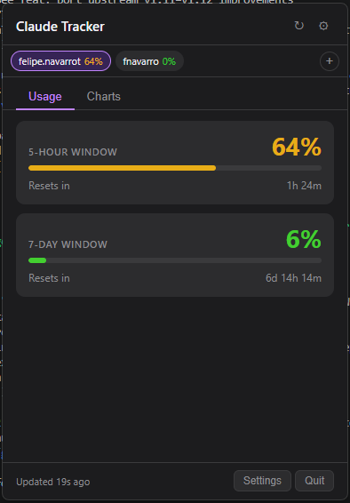
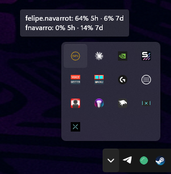

# Claude Tracker — Windows

A Windows port of [ClaudeTracker](https://github.com/diegovilloutafredes/ClaudeTracker) — a system tray app that shows your Claude AI usage limits in real time.

> **Unofficial tool** — not affiliated with or endorsed by Anthropic. Uses undocumented internal claude.ai endpoints that may change at any time.

## Screenshots

<p align="center">
  
  &nbsp;&nbsp;
  
</p>

## Features

- **Multi-account support** — monitor multiple claude.ai accounts simultaneously; switch active account from the popup; tray tooltip shows all accounts at a glance
- **Live usage bars** for 5-hour and 7-day windows, with color-coded urgency (green → yellow → red)
- **Countdown timers** until each window resets
- **Pace indicators** — current consumption rate (%/hr) and projected time to full
- **Pace alerts** — notification when you're projected to hit the limit before reset
- **Historical charts** — 30-day usage history, selectable time ranges, urgency-colored lines, shared hover crosshair
- **Per-alert notifications** — independent sound, duration and enable controls for 5h reset, 7d reset and pace alerts
- **Configurable** refresh interval, popup scale, open at login, auto-check for updates, and more
- No API key required — uses your existing claude.ai browser session

## Requirements

- Windows 10 or 11 (64-bit)
- An active [claude.ai](https://claude.ai) account

## Installation

### Option A: Download installer (recommended)
Download the latest `.exe` from [Releases](https://github.com/Unvitewewe/ClaudeTracker-Windows/releases).

### Option B: Run from source
```
git clone https://github.com/Unvitewewe/ClaudeTracker-Windows.git
cd ClaudeTracker-Windows
npm install
npm start
```

## First run

1. The app starts in the system tray (bottom-right, near the clock)
2. Click the tray icon to open the popup
3. Click **Sign In** — a browser window opens to claude.ai
4. Log in as normal; the window closes automatically once the session is detected
5. Usage data appears within a few seconds

## Building

```bash
npm run build       # NSIS installer + portable .exe → dist/
npm run build:dir   # Unpacked app only (faster, for testing)
npm run portable    # Portable .exe only
```

Requires Node.js 18+ and npm.

## Adding an app icon

Place a 256×256 `icon.ico` in the `assets/` folder before building. You can convert any PNG using:
- [CloudConvert](https://cloudconvert.com/png-to-ico) (online)
- `magick icon.png -resize 256x256 assets/icon.ico` (ImageMagick)

## How it works

Claude Tracker launches a hidden Chromium window (via Electron) that loads claude.ai. API calls are made via JavaScript `fetch()` within that window — so requests carry the correct session cookies and headers, bypassing Cloudflare bot detection. Your session persists across restarts.

## Differences from the macOS version

| Feature | macOS | Windows |
|---|---|---|
| Menu bar icon with % text | ✓ | ✓ (system tray) |
| Popup with Usage & Charts tabs | ✓ | ✓ |
| All settings options | ✓ | ✓ |
| Toast notifications | Custom floating toasts | Windows native notifications |
| Sound alerts | macOS system sounds | System notification sound |
| Auto-update | Sparkle/appcast | GitHub Releases |

## License

MIT
